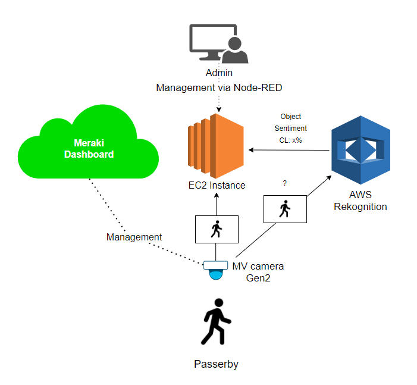
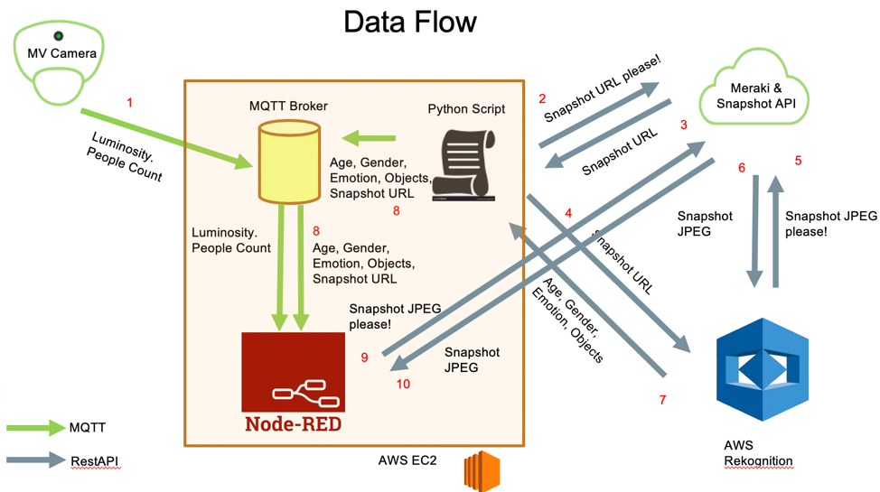
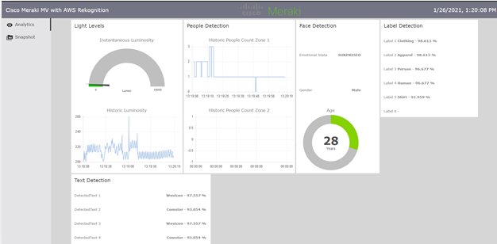

# Overview

This document provides a step by step guide to enabling visualization of some of the [MV](https://meraki.cisco.com/products/security-cameras) Cameras sensor data and snapshots, augmented with Image Analysis from AWS [Regoknition](https://aws.amazon.com/rekognition/), using [NodeRED](https://nodered.org/) as a User Interface.

Here's a simple diagram of what I worked on:

And here's the detailed flow view:

The high level flow is as follows:

1. An  MV camera provides an MQTT stream to an MQTT Broker running in NodeRED . The MQTT stream includes people count (by zone) and luminosity.
2. Every few seconds, A python script requests the URL of a snapshot from our MV camera
3. The Meraki Cloud returns a URL to the Python Script
4. The URL is forwarded to the AWS Rekognition service. AWS Rekognition downloads the snapshot using the URL and performs Machine Learning based object and face recognition on the snapshot
5. AWS recognition returns the result of the object and facial analysis to the Python Script (e.g. house, computer, phone, Male, 40 years old, sad)
6. The results are forwarded in MQTT to an MQTT Broker, along with the snapshot URL
7. The MQTT Broker forwards this (along with the earlier details around People Count and Luminosity) to NodeRED&#39;s Graphical User Interface
8. The information is presented by NodeRED, including the snapshot image URL

## Setup

I've created an In-depth Setup guide, including details on how to setup:
- EC2 host with Python, Node-RED, and working MQTT server
- Dependencies on the host
- How to connect and manage the host
- Setting up AWS Rekognition
- Setting up AWS CLI for Rekognition setup in the host
- Setting up Node-RED with MQTT
- Setting up the Python script in the host

I will share the guide through different medium later on, possibly posting some details on my medium profile:
https://andrecamillo.medium.com/

## Version 2, june 2021

I've improved the code adding a few more capabilities including:

Frontend
- Added more tabs to Node-red, highlighting "Audience Analytics" with:
  - Audience Age estimatives
  - Audience Reaction in a Wordcloud
- Added "About" tab in frontend to highlight Who is demoing
- Authentication to Node-red Admin and UI

Backend
- Integration with 3rd party service for the wordcloud creation
- basic algorithm to count reactions and send them to wordcloud

Will add v2 in the list of files and will create a document about it and share on medium:
https://andrecamillo.medium.com/
